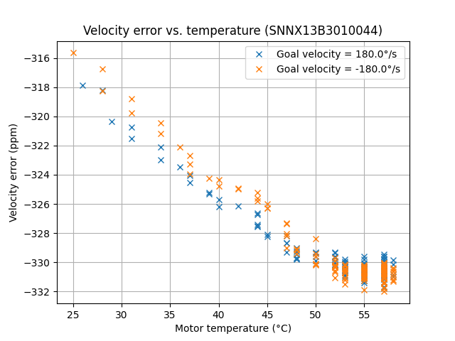
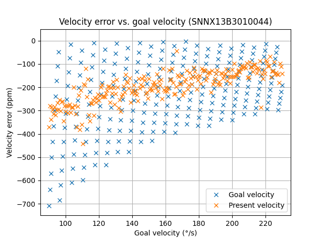

# DYNAMIXEL-Y

DYNAMIXEL-Y driver for use in IMU calibration equipment.

Includes velocity error investigations, with velocity errors measured using an optical encoder and a rubidium-disciplined Keysight 5322A frequency counter.

